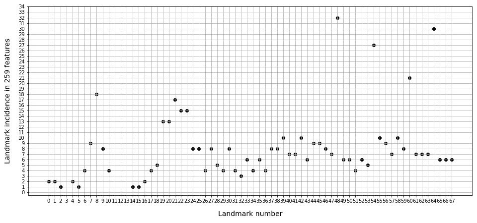
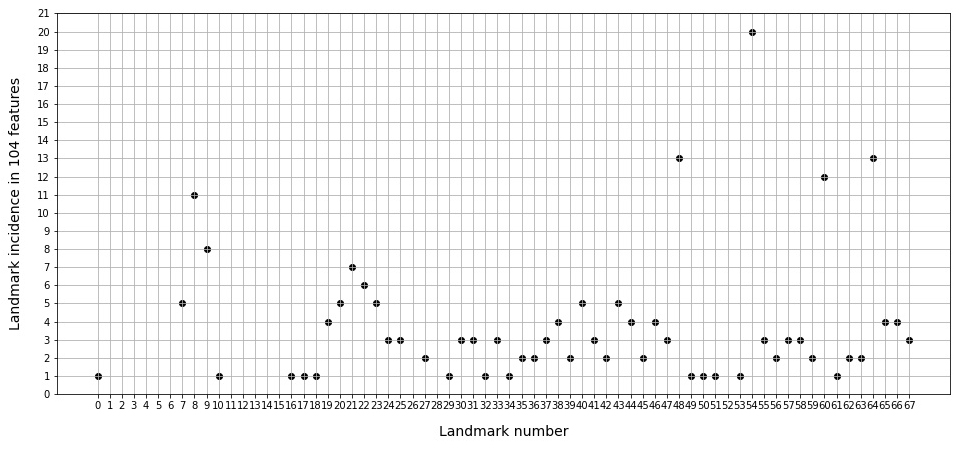

### Текст

> We extracted `2278` Euclidean distances from `120` thousand observations obtained as a result of frame-by-frame extraction of face landmarks from the `RAVDESS` and `CREMA-D` video databases. We used distances as input to the ensemble classifiers Random Forest Classifier (RFC), Extra Trees Classifier (ETC) and Ada-Boost Classi-fier (ABC) to feature importance scores. As a result of averaging the obtained scores and setting the threshold for evaluations of 0.009, 0.001 and 0.002, we received 368, 259 and 104 pairs of landmarks that are presented in Tables 1, 2 and 3, respectively.

---

#### Table 1. 368 pairs of landmarks for calculating distances

| # | Pair | # | Pair | # | Pair | # | Pair | # | Pair |
| - | ---- | - | ---- | - | ---- | - | ---- | - | ---- |  
| 1 | 0, 16 | 75 | 10, 48 | 149 | 21, 54 | 223 | 33, 62 | 297 | 48, 64 |
| 2 | 0, 17 | 76 | 10, 54 | 150 | 21, 58 | 224 | 34, 63 | 298 | 48, 65 |
| 3 | 1, 45 | 77 | 10, 60 | 151 | 21, 59 | 225 | 35, 48 | 299 | 48, 66 |
| 4 | 1, 54 | 78 | 11, 14 | 152 | 21, 60 | 226 | 35, 50 | 300 | 48, 67 |
| 5 | 2, 26 | 79 | 11, 15 | 153 | 21, 67 | 227 | 35, 52 | 301 | 49, 51 |
| 6 | 2, 48 | 80 | 11, 16 | 154 | 22, 27 | 228 | 35, 53 | 302 | 49, 54 |
| 7 | 4, 17 | 81 | 11, 17 | 155 | 22, 28 | 229 | 36, 48 | 303 | 49, 55 |
| 8 | 4, 25 | 82 | 11, 18 | 156 | 22, 30 | 230 | 36, 60 | 304 | 49, 61 |
| 9 | 5, 17 | 83 | 11, 21 | 157 | 22, 39 | 231 | 36, 66 | 305 | 49, 64 |
| 10 | 5, 18 | 84 | 11, 46 | 158 | 22, 40 | 232 | 37, 39 | 306 | 49, 65 |
| 11 | 5, 23 | 85 | 13, 35 | 159 | 22, 42 | 233 | 37, 40 | 307 | 50, 52 |
| 12 | 5, 27 | 86 | 14, 23 | 160 | 22, 43 | 234 | 37, 41 | 308 | 50, 54 |
| 13 | 6, 19 | 87 | 14, 54 | 161 | 22, 44 | 235 | 37, 48 | 309 | 50, 62 |
| 14 | 6, 23 | 88 | 15, 64 | 162 | 22, 45 | 236 | 37, 60 | 310 | 50, 63 |
| 15 | 6, 25 | 89 | 16, 25 | 163 | 22, 46 | 237 | 37, 64 | 311 | 50, 64 |
| 16 | 6, 56 | 90 | 16, 64 | 164 | 22, 52 | 238 | 38, 40 | 312 | 51, 52 |
| 17 | 6, 64 | 91 | 17, 21 | 165 | 22, 54 | 239 | 38, 41 | 313 | 51, 53 |
| 18 | 7, 18 | 92 | 17, 25 | 166 | 22, 55 | 240 | 38, 43 | 314 | 51, 60 |
| 19 | 7, 19 | 93 | 17, 26 | 167 | 22, 56 | 241 | 38, 45 | 315 | 51, 63 |
| 20 | 7, 20 | 94 | 17, 36 | 168 | 22, 58 | 242 | 38, 48 | 316 | 52, 58 |
| 21 | 7, 21 | 95 | 17, 48 | 169 | 22, 64 | 243 | 38, 60 | 317 | 52, 60 |
| 22 | 7, 25 | 96 | 18, 21 | 170 | 22, 66 | 244 | 39, 48 | 318 | 52, 61 |
| 23 | 7, 39 | 97 | 18, 22 | 171 | 23, 27 | 245 | 39, 49 | 319 | 53, 59 |
| 24 | 7, 48 | 98 | 18, 23 | 172 | 23, 35 | 246 | 39, 57 | 320 | 53, 60 |
| 25 | 7, 54 | 99 | 18, 25 | 173 | 23, 36 | 247 | 39, 60 | 321 | 53, 61 |
| 26 | 7, 57 | 100 | 18, 26 | 174 | 23, 39 | 248 | 39, 61 | 322 | 53, 66 |
| 27 | 7, 60 | 101 | 18, 37 | 175 | 23, 42 | 249 | 39, 62 | 323 | 53, 67 |
| 28 | 7, 64 | 102 | 18, 41 | 176 | 23, 43 | 250 | 40, 48 | 324 | 54, 55 |
| 29 | 7, 65 | 103 | 18, 48 | 177 | 23, 45 | 251 | 41, 48 | 325 | 54, 56 |
| 30 | 8, 19 | 104 | 19, 22 | 178 | 23, 46 | 252 | 41, 60 | 326 | 54, 57 |
| 31 | 8, 20 | 105 | 19, 23 | 179 | 23, 47 | 253 | 42, 45 | 327 | 54, 58 |
| 32 | 8, 21 | 106 | 19, 31 | 180 | 23, 48 | 254 | 42, 52 | 328 | 54, 59 |
| 33 | 8, 22 | 107 | 19, 32 | 181 | 23, 55 | 255 | 42, 53 | 329 | 54, 60 |
| 34 | 8, 23 | 108 | 19, 37 | 182 | 24, 27 | 256 | 42, 54 | 330 | 54, 61 |
| 35 | 8, 24 | 109 | 19, 38 | 183 | 24, 42 | 257 | 42, 57 | 331 | 54, 62 |
| 36 | 8, 27 | 110 | 19, 39 | 184 | 24, 45 | 258 | 42, 58 | 332 | 54, 63 |
| 37 | 8, 28 | 111 | 19, 40 | 185 | 24, 46 | 259 | 42, 64 | 333 | 54, 65 |
| 38 | 8, 29 | 112 | 19, 41 | 186 | 24, 47 | 260 | 43, 46 | 334 | 54, 66 |
| 39 | 8, 30 | 113 | 19, 48 | 187 | 24, 64 | 261 | 43, 47 | 335 | 54, 67 |
| 40 | 8, 41 | 114 | 19, 49 | 188 | 24, 66 | 262 | 43, 54 | 336 | 55, 56 |
| 41 | 8, 43 | 115 | 20, 22 | 189 | 25, 47 | 263 | 43, 55 | 337 | 55, 59 |
| 42 | 8, 48 | 116 | 20, 23 | 190 | 25, 54 | 264 | 43, 58 | 338 | 55, 60 |
| 43 | 8, 49 | 117 | 20, 27 | 191 | 26, 45 | 265 | 43, 64 | 339 | 55, 64 |
| 44 | 8, 54 | 118 | 20, 28 | 192 | 26, 54 | 266 | 43, 65 | 340 | 56, 58 |
| 45 | 8, 55 | 119 | 20, 30 | 193 | 26, 64 | 267 | 44, 46 | 341 | 56, 59 |
| 46 | 8, 59 | 120 | 20, 38 | 194 | 27, 48 | 268 | 44, 47 | 342 | 56, 60 |
| 47 | 8, 60 | 121 | 20, 39 | 195 | 27, 64 | 269 | 44, 54 | 343 | 56, 63 |
| 48 | 8, 62 | 122 | 20, 40 | 196 | 28, 53 | 270 | 44, 55 | 344 | 56, 64 |
| 49 | 8, 63 | 123 | 20, 41 | 197 | 29, 33 | 271 | 44, 56 | 345 | 56, 65 |
| 50 | 8, 64 | 124 | 20, 42 | 198 | 29, 51 | 272 | 44, 58 | 346 | 57, 60 |
| 51 | 8, 66 | 125 | 20, 44 | 199 | 29, 61 | 273 | 44, 64 | 347 | 57, 64 |
| 52 | 8, 67 | 126 | 20, 48 | 200 | 29, 62 | 274 | 44, 65 | 348 | 57, 65 |
| 53 | 9, 18 | 127 | 20, 49 | 201 | 29, 63 | 275 | 44, 66 | 349 | 57, 66 |
| 54 | 9, 20 | 128 | 20, 51 | 202 | 30, 33 | 276 | 45, 54 | 350 | 58, 59 |
| 55 | 9, 21 | 129 | 20, 52 | 203 | 30, 50 | 277 | 45, 55 | 351 | 58, 60 |
| 56 | 9, 22 | 130 | 20, 54 | 204 | 30, 51 | 278 | 45, 56 | 352 | 58, 63 |
| 57 | 9, 23 | 131 | 20, 64 | 205 | 30, 53 | 279 | 45, 58 | 353 | 58, 64 |
| 58 | 9, 24 | 132 | 21, 22 | 206 | 30, 61 | 280 | 45, 64 | 354 | 58, 67 |
| 59 | 9, 25 | 133 | 21, 23 | 207 | 30, 62 | 281 | 46, 54 | 355 | 59, 60 |
| 60 | 9, 38 | 134 | 21, 24 | 208 | 30, 63 | 282 | 46, 64 | 356 | 59, 64 |
| 61 | 9, 39 | 135 | 21, 25 | 209 | 31, 33 | 283 | 47, 54 | 357 | 60, 61 |
| 62 | 9, 40 | 136 | 21, 27 | 210 | 31, 34 | 284 | 47, 64 | 358 | 60, 62 |
| 63 | 9, 44 | 137 | 21, 28 | 211 | 31, 35 | 285 | 48, 50 | 359 | 60, 63 |
| 64 | 9, 48 | 138 | 21, 29 | 212 | 31, 53 | 286 | 48, 52 | 360 | 60, 64 |
| 65 | 9, 54 | 139 | 21, 30 | 213 | 31, 56 | 287 | 48, 53 | 361 | 60, 65 |
| 66 | 9, 60 | 140 | 21, 36 | 214 | 31, 57 | 288 | 48, 54 | 362 | 60, 66 |
| 67 | 9, 64 | 141 | 21, 37 | 215 | 31, 64 | 289 | 48, 55 | 363 | 60, 67 |
| 68 | 10, 15 | 142 | 21, 38 | 216 | 32, 34 | 290 | 48, 56 | 364 | 61, 64 |
| 69 | 10, 18 | 143 | 21, 39 | 217 | 32, 35 | 291 | 48, 57 | 365 | 62, 64 |
| 70 | 10, 21 | 144 | 21, 40 | 218 | 32, 50 | 292 | 48, 58 | 366 | 64, 65 |
| 71 | 10, 24 | 145 | 21, 41 | 219 | 32, 61 | 293 | 48, 59 | 367 | 64, 66 |
| 72 | 10, 25 | 146 | 21, 42 | 220 | 33, 34 | 294 | 48, 61 | 368 | 64, 67 |
| 73 | 10, 27 | 147 | 21, 46 | 221 | 33, 35 | 295 | 48, 62 |  | |
| 74 | 10, 43 | 148 | 21, 48 | 222 | 33, 61 | 296 | 48, 63 |  | |

#### Table 2. 259 pairs of landmarks for calculating distances

| # | Pair | # | Pair | # | Pair | # | Pair | # | Pair |
| - | ---- | - | ---- | - | ---- | - | ---- | - | ---- | 
| 1 | 0, 16 | 53 | 15, 64 | 105 | 22, 55 | 157 | 38, 40 | 209 | 48, 67 |
| 2 | 0, 17 | 54 | 16, 64 | 106 | 22, 64 | 158 | 38, 41 | 210 | 49, 51 |
| 3 | 1, 45 | 55 | 17, 36 | 107 | 23, 27 | 159 | 38, 43 | 211 | 49, 54 |
| 4 | 1, 54 | 56 | 17, 48 | 108 | 23, 42 | 160 | 38, 45 | 212 | 49, 61 |
| 5 | 2, 26 | 57 | 18, 22 | 109 | 23, 43 | 161 | 38, 48 | 213 | 49, 64 |
| 6 | 4, 17 | 58 | 18, 23 | 110 | 23, 45 | 162 | 39, 48 | 214 | 49, 65 |
| 7 | 4, 25 | 59 | 18, 25 | 111 | 23, 46 | 163 | 39, 57 | 215 | 50, 52 |
| 8 | 5, 27 | 60 | 18, 37 | 112 | 23, 47 | 164 | 39, 60 | 216 | 50, 63 |
| 9 | 6, 19 | 61 | 19, 22 | 113 | 23, 48 | 165 | 39, 62 | 217 | 50, 64 |
| 10 | 6, 23 | 62 | 19, 23 | 114 | 23, 55 | 166 | 40, 48 | 218 | 51, 60 |
| 11 | 6, 56 | 63 | 19, 31 | 115 | 24, 27 | 167 | 41, 48 | 219 | 52, 60 |
| 12 | 6, 64 | 64 | 19, 32 | 116 | 24, 42 | 168 | 42, 45 | 220 | 52, 61 |
| 13 | 7, 18 | 65 | 19, 37 | 117 | 24, 45 | 169 | 42, 52 | 221 | 53, 59 |
| 14 | 7, 19 | 66 | 19, 38 | 118 | 24, 46 | 170 | 42, 54 | 222 | 53, 60 |
| 15 | 7, 20 | 67 | 19, 39 | 119 | 24, 47 | 171 | 42, 57 | 223 | 54, 55 |
| 16 | 7, 25 | 68 | 19, 40 | 120 | 24, 64 | 172 | 42, 58 | 224 | 54, 56 |
| 17 | 7, 39 | 69 | 19, 41 | 121 | 25, 47 | 173 | 42, 64 | 225 | 54, 57 |
| 18 | 7, 48 | 70 | 19, 48 | 122 | 25, 54 | 174 | 43, 46 | 226 | 54, 58 |
| 19 | 7, 54 | 71 | 20, 22 | 123 | 26, 45 | 175 | 43, 47 | 227 | 54, 59 |
| 20 | 7, 60 | 72 | 20, 23 | 124 | 26, 54 | 176 | 43, 54 | 228 | 54, 60 |
| 21 | 7, 64 | 73 | 20, 27 | 125 | 26, 64 | 177 | 43, 64 | 229 | 54, 63 |
| 22 | 8, 19 | 74 | 20, 28 | 126 | 27, 48 | 178 | 44, 46 | 230 | 54, 65 |
| 23 | 8, 20 | 75 | 20, 30 | 127 | 28, 53 | 179 | 44, 47 | 231 | 54, 66 |
| 24 | 8, 21 | 76 | 20, 38 | 128 | 29, 33 | 180 | 44, 54 | 232 | 54, 67 |
| 25 | 8, 22 | 77 | 20, 39 | 129 | 29, 51 | 181 | 44, 55 | 233 | 55, 56 |
| 26 | 8, 23 | 78 | 20, 40 | 130 | 29, 61 | 182 | 44, 56 | 234 | 55, 59 |
| 27 | 8, 24 | 79 | 20, 41 | 131 | 29, 62 | 183 | 44, 58 | 235 | 55, 60 |
| 28 | 8, 27 | 80 | 20, 42 | 132 | 30, 50 | 184 | 44, 64 | 236 | 55, 64 |
| 29 | 8, 28 | 81 | 20, 48 | 133 | 30, 51 | 185 | 44, 65 | 237 | 56, 58 |
| 30 | 8, 41 | 82 | 21, 22 | 134 | 30, 61 | 186 | 44, 66 | 238 | 56, 59 |
| 31 | 8, 48 | 83 | 21, 23 | 135 | 30, 62 | 187 | 45, 54 | 239 | 56, 60 |
| 32 | 8, 49 | 84 | 21, 25 | 136 | 30, 63 | 188 | 45, 58 | 240 | 56, 64 |
| 33 | 8, 54 | 85 | 21, 27 | 137 | 31, 33 | 189 | 45, 64 | 241 | 57, 60 |
| 34 | 8, 55 | 86 | 21, 28 | 138 | 31, 34 | 190 | 46, 54 | 242 | 57, 64 |
| 35 | 8, 59 | 87 | 21, 30 | 139 | 31, 35 | 191 | 46, 64 | 243 | 57, 66 |
| 36 | 8, 60 | 88 | 21, 36 | 140 | 32, 34 | 192 | 47, 54 | 244 | 58, 59 |
| 37 | 8, 63 | 89 | 21, 37 | 141 | 32, 35 | 193 | 47, 64 | 245 | 58, 60 |
| 38 | 8, 64 | 90 | 21, 38 | 142 | 33, 34 | 194 | 48, 50 | 246 | 58, 64 |
| 39 | 8, 67 | 91 | 21, 39 | 143 | 33, 35 | 195 | 48, 52 | 247 | 58, 67 |
| 40 | 9, 21 | 92 | 21, 40 | 144 | 33, 61 | 196 | 48, 53 | 248 | 59, 64 |
| 41 | 9, 23 | 93 | 21, 41 | 145 | 33, 62 | 197 | 48, 54 | 249 | 60, 62 |
| 42 | 9, 24 | 94 | 21, 46 | 146 | 34, 63 | 198 | 48, 55 | 250 | 60, 63 |
| 43 | 9, 25 | 95 | 21, 48 | 147 | 35, 50 | 199 | 48, 56 | 251 | 60, 64 |
| 44 | 9, 48 | 96 | 21, 60 | 148 | 35, 52 | 200 | 48, 57 | 252 | 60, 65 |
| 45 | 9, 54 | 97 | 22, 27 | 149 | 35, 53 | 201 | 48, 58 | 253 | 60, 66 |
| 46 | 9, 60 | 98 | 22, 28 | 150 | 36, 48 | 202 | 48, 59 | 254 | 60, 67 |
| 47 | 9, 64 | 99 | 22, 30 | 151 | 36, 60 | 203 | 48, 61 | 255 | 61, 64 |
| 48 | 10, 25 | 100 | 22, 39 | 152 | 37, 39 | 204 | 48, 62 | 256 | 62, 64 |
| 49 | 10, 48 | 101 | 22, 40 | 153 | 37, 40 | 205 | 48, 63 | 257 | 64, 65 |
| 50 | 10, 54 | 102 | 22, 42 | 154 | 37, 41 | 206 | 48, 64 | 258 | 64, 66 |
| 51 | 10, 60 | 103 | 22, 46 | 155 | 37, 48 | 207 | 48, 65 | 259 | 64, 67 |
| 52 | 14, 54 | 104 | 22, 54 | 156 | 37, 64 | 208 | 48, 66 |  |  |

#### Table 3. 104 pairs of landmarks for calculating distances

| # | Pair | # | Pair | # | Pair | # | Pair | # | Pair |
| - | ---- | - | ---- | - | ---- | - | ---- | - | ---- | 
| 1| 0, 16| 22| 9, 48| 43| 23, 42| 64| 43, 46| 85| 54, 57 |
| 2| 7, 19| 23| 9, 54| 44| 23, 43| 65| 43, 47| 86| 54, 58 |
| 3| 7, 20| 24| 9, 60| 45| 23, 47| 66| 43, 54| 87| 54, 60 |
| 4| 7, 48| 25| 9, 64| 46| 24, 46| 67| 44, 46| 88| 54, 65 |
| 5| 7, 54| 26| 10, 54| 47| 25, 54| 68| 44, 47| 89| 54, 66 |
| 6| 7, 60| 27| 17, 36| 48| 29, 33| 69| 44, 54| 90| 54, 67 |
| 7| 8, 19| 28| 18, 25| 49| 30, 51| 70| 44, 64| 91| 55, 60 |
| 8| 8, 20| 29| 19, 39| 50| 30, 62| 71| 45, 54| 92| 56, 60 |
| 9| 8, 21| 30| 19, 40| 51| 31, 33| 72| 45, 64| 93| 57, 64 |
| 10| 8, 24| 31| 20, 22| 52| 31, 34| 73| 46, 54| 94| 58, 64 |
| 11| 8, 27| 32| 20, 39| 53| 31, 35| 74| 48, 54| 95| 59, 64 |
| 12| 8, 48 | 33| 20, 40| 54| 32, 35| 75| 48, 57| 96| 60, 63 |
| 13| 8, 54| 34| 21, 22| 55| 33, 62| 76| 48, 58| 97| 60, 64 |
| 14| 8, 55| 35| 21, 23| 56| 36, 48| 77| 48, 64| 98| 60, 65 |
| 15| 8, 59| 36| 21, 37| 57| 37, 40| 78| 48, 65| 99| 60, 66 |
| 16| 8, 60| 37| 21, 38| 58| 37, 41| 79| 48, 66| 100| 60, 67 |
| 17| 8, 64| 38| 21, 48| 59| 38, 40| 80| 49, 54| 101| 61, 64 |
| 18| 9, 21| 39| 22, 27| 60| 38, 41| 81| 50, 63| 102| 64, 65 |
| 19| 9, 23| 40| 22, 30| 61| 38, 43| 82| 53, 60| 103| 64, 66 |
| 21| 9, 24| 41| 22, 42| 62| 40, 48| 83| 54, 55| 104| 64, 67 |
| 22| 9, 25| 42| 22, 54| 63| 41, 48| 84| 54, 56| |  |

> Landmark incidence in 368, 259 and 104 features are shown in Figures 1, 2 and 3, respectively. As one can see from the figures 1, 2 and 3, most important landmarks are 48, 54, 60, 64, which are the corners of the mouth, 7, 8 and 9 are landmarks the angle of the chin, from 19 to 23 are landmarks the eyebrows.

---

#### Fig. 1. Landmark incidence in 368 features

<h4 align="center"></h4>

#### Fig. 2. Landmark incidence in 259 features

<h4 align="center"></h4>

#### Fig. 3. Landmark incidence in 104 features

<h4 align="center"></h4>
